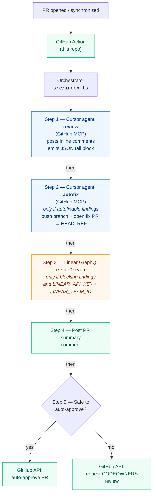

# Cursor SDK PR Review Action

> Looking for the operator's guide? See [`USAGE.md`](USAGE.md) for installation, configuration, troubleshooting, and FAQ.

GitHub Action that uses the [Cursor TypeScript SDK](https://cursor.com/docs/api/sdk/typescript) to:

1. Run a cloud Cursor agent that reviews the PR diff and posts inline review comments.
2. Classify the change complexity (`low` / `medium` / `high`) and tag each finding as autofixable or not.
3. If anything is autofixable, run a second cloud agent that opens a fix-PR back to the feature branch.
4. If any non-autofixable findings remain, file a single Linear issue aggregating them.
5. If the agent classified the change as `low` complexity and there are no blocking findings, auto-approve the PR. Otherwise, request review from CODEOWNERS.

## Architecture



The chain reflects the sequential order in [`src/index.ts`](src/index.ts). Steps 2 and 3 are no-ops when their precondition (autofixable findings / blocking findings + Linear configured) doesn't hold; the pipeline still proceeds to the next step.

Both agent calls support `local` (default) or `cloud` runtime via the `CURSOR_RUNTIME` env var — see [Choosing a runtime](USAGE.md#choosing-a-runtime). Local runs on the Actions runner against the checked-out workspace; cloud runs in a Cursor-hosted VM that clones the repo via the Cursor GitHub App. Both use the GitHub MCP for posting comments and opening the fix PR.

## Required configuration

For a copy-paste workflow you can drop into another repo, see [`examples/cursor-pr-review.yml`](examples/cursor-pr-review.yml) and [`examples/README.md`](examples/README.md).

### Secrets

| Name              | Where           | Required | Notes                                                                 |
| ----------------- | --------------- | -------- | --------------------------------------------------------------------- |
| `CURSOR_API_KEY`  | repo secret     | yes      | Cursor team service-account key (preferred) or user key.              |
| `LINEAR_API_KEY`  | repo secret     | optional | Linear personal API key. If unset, Linear issue creation is skipped. |

`GITHUB_TOKEN` is provided automatically by Actions; the workflow grants it `pull-requests: write`, `issues: write`, and `contents: write` (so the `local` runtime can push the autofix branch).

### Variables

| Name             | Where           | Required | Notes                                                                                                       |
| ---------------- | --------------- | -------- | ----------------------------------------------------------------------------------------------------------- |
| `LINEAR_TEAM_ID` | repo variable   | optional | UUID of the Linear team that should own filed issues. Required if you want Linear integration to function. |

### Label gates

The orchestrator is opt-in per PR via labels. Each label only enables its own step; nothing runs by default:

| Label               | Effect when present                                              |
| ------------------- | ---------------------------------------------------------------- |
| `cursor-review`     | Run the review agent and post inline comments + summary comment. |
| `cursor-autofix`    | Run the autofix agent and open the fix-PR (only if `cursor-review` is also set and there are autofixable findings). |
| `cursor-autolinear` | File a Linear issue for blocking findings (only if `cursor-review` is also set, blocking findings exist, and `LINEAR_API_KEY` + `LINEAR_TEAM_ID` are configured). |

If `cursor-review` is missing, the action exits 0 silently — no review, no autofix, no Linear issue, no auto-approve, and no CODEOWNERS request. The workflow listens for the pull_request `labeled` event, which GitHub emits whenever **any** label is added to the PR — not only `cursor-review` or the other gate labels above — so tagging unrelated labels also starts a new run.

## How it decides

- **Auto-approve** runs only when **all** of:
  - the agent classified complexity as `low`,
  - there are zero non-autofixable findings, and
  - if autofix was attempted, a fix-PR URL was reported.
- Otherwise, the action calls `pulls.requestReviewers` against owners resolved from `.github/CODEOWNERS` (or `CODEOWNERS` / `docs/CODEOWNERS`) for the changed files. GitHub will already auto-request CODEOWNERS via branch protection if configured; this is a redundant safety net.

## Behavior notes

- The review prompt requires the agent to emit a `<<<CURSOR_REVIEW_JSON>>> ... <<<END_CURSOR_REVIEW_JSON>>>` block. If that block is missing or invalid, the orchestrator exits with code `3` and never auto-approves.
- The autofix agent uses the GitHub MCP to open a PR explicitly targeting the head branch. We do **not** use `cloud.autoCreatePR` because that opens PRs against the default branch, which is not what we want here.
- Linear failures are non-blocking: they log and let the approval flow continue.
- The action posts a single summary comment on the PR with complexity, finding counts, fix-PR URL (if any), and Linear issue URL (if any).

## Exit codes

| Code | Meaning                                                                                                |
| ---- | ------------------------------------------------------------------------------------------------------ |
| 0    | Success.                                                                                               |
| 1    | Permanent startup failure (env error, non-retryable `CursorAgentError`, unexpected error).             |
| 2    | Review run executed but ended with `result.status === "error"` (or non-`finished`).                    |
| 3    | Review JSON tail block was missing or invalid; classification unknown, do not auto-approve.            |
| 75   | Transient `CursorAgentError` (`isRetryable=true`). Re-run the workflow.                                |

## Local development

```bash
npm install
npm run typecheck
```

Set the env vars from the workflow file and run `npm start` to invoke the orchestrator against an existing PR.

## Limitations

- **PRs from public forks are not reviewed by default.** The bundled workflow uses `on: pull_request`, and GitHub does not pass repository secrets (including `CURSOR_API_KEY`) to runs triggered from a public fork — so the orchestrator step fails fast with a missing-secret error on fork PRs. The default install only reliably reviews PRs whose head branch lives in the same repo. Fork coverage requires switching to `pull_request_target` or a `workflow_run` split with a deliberate security design — see the [fork FAQ in `USAGE.md`](USAGE.md#faq).
- Cloud agent runtime requires the Cursor account to have repo access (GitHub App installation). Without it, the cloud run cannot clone the repo.
- The CODEOWNERS parser implements a simplified subset of the matching rules (rooted paths, `*`, `**`, trailing `/` for directories, `?` for single character). Complex patterns may not match exactly the way GitHub does; treat the explicit `requestReviewers` call as a hint, not the source of truth — branch protection should still enforce real CODEOWNERS rules.
- The autofix agent is intentionally conservative: it skips findings it cannot mechanically resolve. Skipped findings remain in the original PR.
